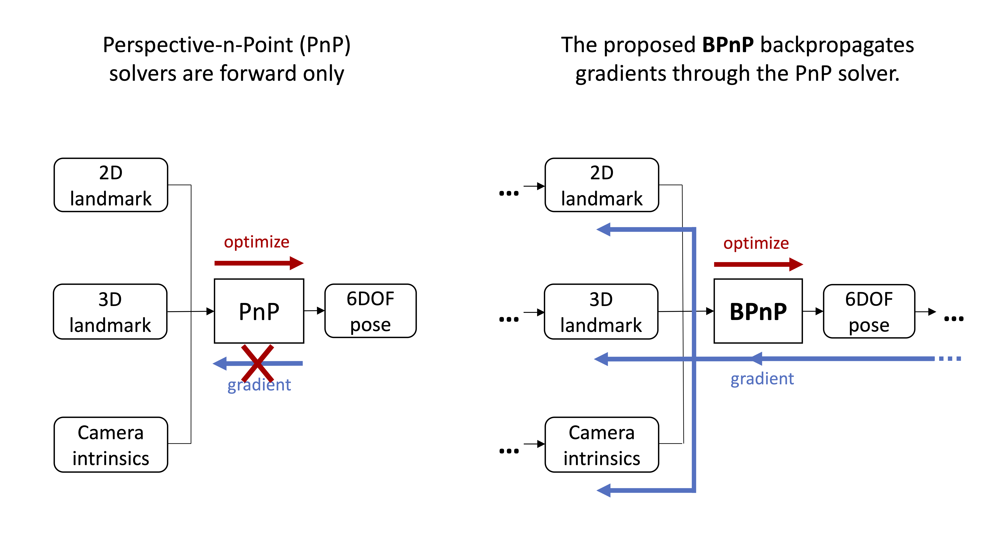

This repo provides the code used in the paper
# [End-to-End Learnable Geometric Vision by Backpropagating PnP Optimization (CVPR 2020)](https://arxiv.org/pdf/1909.06043.pdf)



## Watch our video demo
[](https://youtu.be/eYmoAAsiBEE)

## Install

`bash requirements.sh`


## Back-propagatable PnP (BPnP)

Using BPnP is easy. Just add the following line in your code
````bash
import BPnP
bpnp = BPnP.BPnP.apply
````
Then you can use it as any autograd function in Pytorch.

## Demo experiments

To see the demos presented in the paper, run
````bash
python demoPoseEst.py
````
or
````bash
python demoSfM.py
````
or
````bash
python demoCamCali.py
````

## Cite this work
````
@inproceedings{BPnP2020,
    Author = {Chen, Bo and Parra, Alvaro and Cao, Jiewei and Li, Nan and Chin, Tat-Jun},
    Title = {End-to-End Learnable Geometric Vision by Backpropagating PnP Optimization},
    Booktitle = {CVPR},
    Year = {2020}}
````
